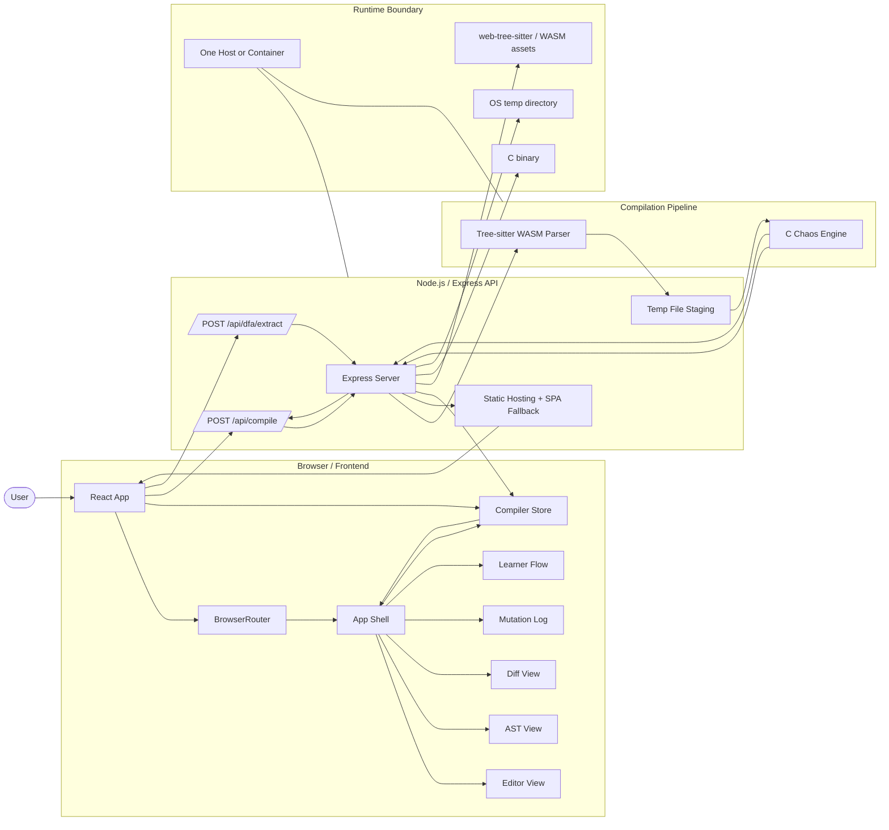

# Chaos Compiler Architecture

This document describes the current system architecture of Chaos Compiler as it exists in the repository: what runs where, how requests move through the system, and which parts own each responsibility.

## 1. System Purpose

Chaos Compiler is a browser-based compiler workbench for C and C++ that combines three things:

- source editing and visualization in a React UI
- AST generation and orchestration in a Node.js API
- AST mutation in a native C execution engine

The product is designed to help users inspect compiler stages, visualize ASTs, and intentionally mutate code structures for learning and stress-testing.

## 2. Architecture Style

The system is best described as a monolithic web application with a native processing sidecar:

- the frontend is a single-page app
- the backend is a single Express server
- the mutation engine is a separate C binary invoked per request
- there is no persistent database in the main request path
- request state is ephemeral and mostly lives in memory or temporary files

That shape is intentional: the browser handles interaction and visualization, Node.js handles request orchestration and parsing, and C handles mutation logic where tight control and performance matter.

## 3. Combined Mermaid Diagram

This is the only Mermaid block in the file. It combines the frontend, backend, parser, mutation engine, runtime boundaries, and request flow into one valid diagram.

### Responsibility split

- **Frontend**: editor, routing, theming, animation, and result rendering
- **API server**: input validation, file handling, compile orchestration, static asset hosting
- **Parser**: converts source text to AST JSON safely in Node
- **Native engine**: applies mutations and returns mutated AST plus mutation metadata
- **DFA route**: returns a canonical lexer DFA for the learning UI

## 4. Backend and Runtime Behavior

The Node.js server is the orchestration layer. It does not perform the heavy mutation work itself; it coordinates the parser, temporary storage, and the native engine.

### Express app responsibilities

- accept compile requests and file uploads
- enforce file size and extension limits
- convert inputs into a normalized source payload
- call the Tree-sitter parser
- optionally call the mutation engine
- clean up temp files
- return a stable JSON response to the frontend
- serve the built frontend when available

### Backend processing steps

1. Receive file upload or JSON source code
2. Validate extension and size
3. Save uploaded or inline source to a temp file
4. Read the source text
5. Parse source with Tree-sitter WASM
6. If mutation is enabled, write AST JSON to a temp AST file
7. Invoke the C binary with compile and mutation flags
8. Parse the engine output
9. Return AST, mutations, and warnings to the frontend
10. Delete temp artifacts

### Failure handling

The backend is defensive in a few specific places:

- invalid file extensions are rejected early
- oversized uploads return a 1 MB error
- parser or engine failures return compiler errors instead of crashing the process
- temp files are cleaned up in a finally block
- engine timeout is capped at 15 seconds

## 5. Frontend Architecture

The frontend is a React SPA built with Vite. It is responsible for all interactive presentation and local application state.

### 5.1 Key frontend responsibilities

- code editing and keyboard shortcuts
- route-based workspace navigation
- theme selection
- presentation of AST, diff, mutation log, and learning views
- user feedback for compile success, errors, and warnings

### 5.2 Main frontend entrypoints

- [client/src/App.jsx](client/src/App.jsx): app shell, routing, transitions, keyboard shortcuts
- [client/src/store/useCompilerStore.jsx](client/src/store/useCompilerStore.jsx): global compiler state and reducer
- [client/src/api/compile.js](client/src/api/compile.js): compile API client

### 5.3 Frontend state model

The compiler store acts as the central UI state container. It keeps:

- current source code
- compile status
- AST payload
- mutation list
- warnings and errors
- compile options such as seed and intensity

The store is intentionally small and request-driven. It does not mirror backend internals; it only tracks what the UI needs to render and what the user can change.

## 6. Data and Storage Model

The system intentionally avoids a persistent database in the main path.

### Data categories

- **User input**: source code typed or uploaded in the browser
- **Request state**: compile options and UI status in the frontend store
- **Temp source file**: source saved in the OS temp directory for upload or inline requests
- **Temp AST file**: JSON representation used by the native engine
- **Response payload**: AST, mutations, and warnings returned to the browser

### Storage implications

- data is short-lived and request-scoped
- recompiling regenerates all result artifacts
- the app is suitable for stateless deployment patterns
- horizontal scaling is easier because there is little durable server-side session state

## 7. Key Quality Attributes

### Performance

- parsing is offloaded to Tree-sitter WASM for reliable Node-side parsing
- mutations are isolated in a native process
- frontend transitions are animated but remain local to the browser

### Reliability

- strict input validation on compile requests
- temp file cleanup regardless of success or failure
- engine timeout protection
- compiler errors are surfaced as JSON responses instead of unhandled crashes

### Maintainability

- concerns are split cleanly across frontend, API, parser, and engine
- frontend uses a centralized compiler store
- backend routes are small and purpose-specific
- the architecture can absorb more mutation types without reworking the web UI contract

### Extensibility

- new AST visualizations can be added without changing the compile contract
- new mutation kinds can be added in the C engine and surfaced in the log format
- the DFA route can be replaced by a richer lexer model later
- the Python backend prototype can remain experimental without affecting the active runtime path

## 8. Best Files to Read Next

- [README.md](README.md)
- [server/index.js](server/index.js)
- [server/routes/compile.js](server/routes/compile.js)
- [server/utils/chaosRunner.js](server/utils/chaosRunner.js)
- [client/src/App.jsx](client/src/App.jsx)
- [client/src/store/useCompilerStore.jsx](client/src/store/useCompilerStore.jsx)
- [client/src/api/compile.js](client/src/api/compile.js)
- [server/routes/dfa.js](server/routes/dfa.js)

## 9. Short Architecture Summary

Chaos Compiler is a stateless browser application backed by a thin Express orchestrator and a separate native mutation engine. The frontend owns interaction and visualization, the backend owns parsing and request coordination, Tree-sitter produces the AST, and the C engine performs the mutation step before results return to the UI.